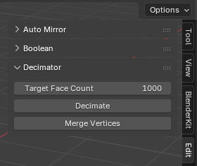
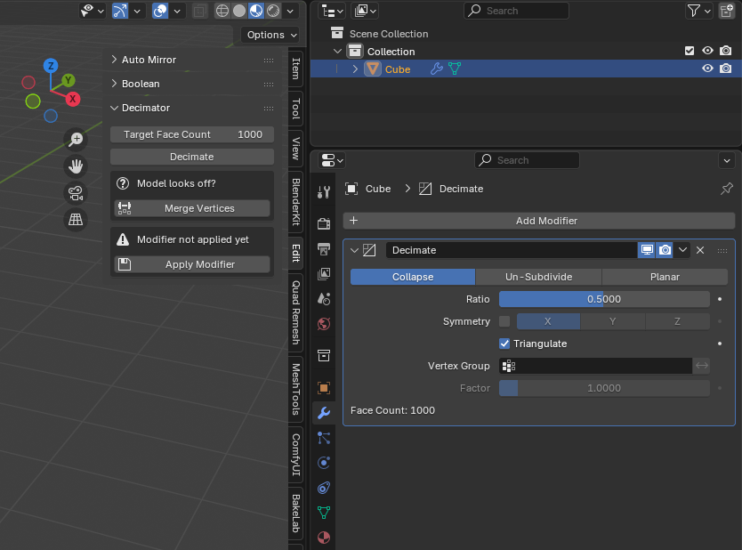

# Decimator Blender Addon

A powerful mesh decimation tool for Blender that reduces polygon count while maintaining mesh quality.

## 📋 Description

The Decimator addon provides an efficient way to reduce mesh complexity by decimating to a target face count. It automates the process of merging vertices, applying decimation, and managing modifiers for optimal results.

## 🎯 Features

- **Target Face Count Control**: Set exact target face count for decimation
- **Vertex Merging**: Automatically merge close vertices before decimation
- **Smart Decimation**: Uses Blender's built-in decimate modifier with collapse type
- **Undo Support**: Full undo/redo functionality
- **User-Friendly Interface**: Simple panel in the 3D Viewport sidebar

## 🛠️ Installation

1. Download the addon file
2. Open Blender
3. Go to **Edit > Preferences > Add-ons**
4. Click **Install** and select the downloaded file
5. Enable the addon by checking the box

## 📖 How to Use

1. Select a mesh object in Edit mode
2. Open the **Edit** tab in the 3D Viewport sidebar
3. Set your desired **Target Face Count**
4. Click **Merge Vertices** to clean up the mesh
5. Click **Decimate** to reduce the polygon count

## ⚙️ Workflow

1. **Merge Vertices** → Removes duplicate/very close vertices
2. **Decimate to Target** → Reduces face count to specified amount
3. **Apply Modifier** → Finalizes the decimation (if needed)

## 📊 Settings

- **Target Face Count**: The desired number of faces after decimation
- **Minimum Value**: 1 face
- **Maximum Value**: Unlimited (limited by original mesh complexity)

## 📝 Notes

- The addon works best on clean, manifold meshes
- Higher target face counts will result in less decimation
- The decimation process is non-destructive (uses modifiers)
- Always backup your original mesh before heavy decimation

## 🔄 Requirements

- Blender 4.5.0 or higher
- Object mode selected with a mesh object

## 📞 Support

For issues or feature requests, please contact the author or submit a GitHub issue.

## 📄 License

This addon is provided as-is. Feel free to modify and distribute according to Blender's licensing terms.

---

*Made with 🖥️ by Rainer Wahnsinn*